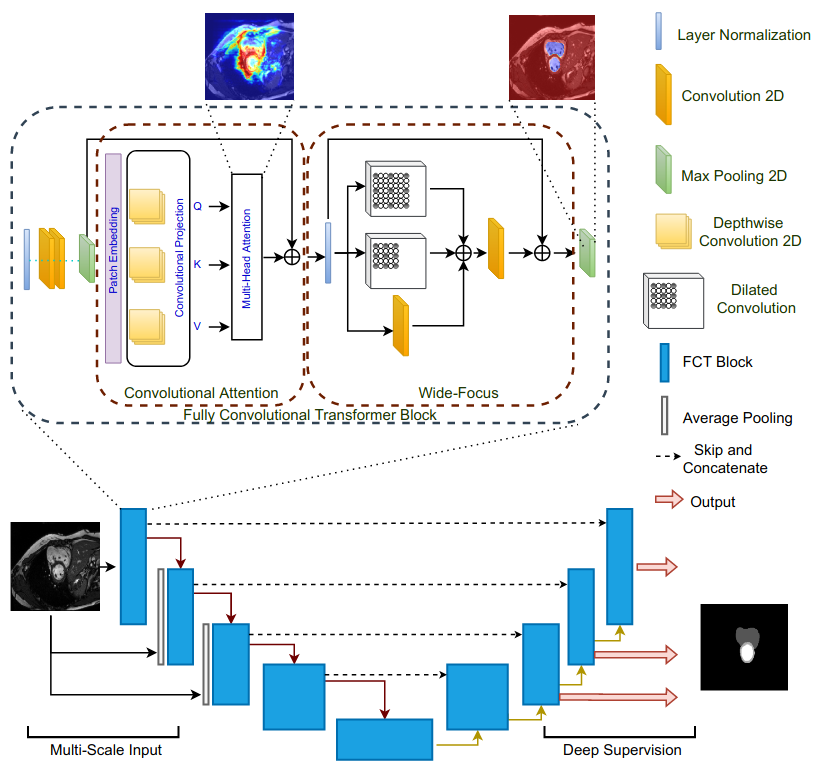
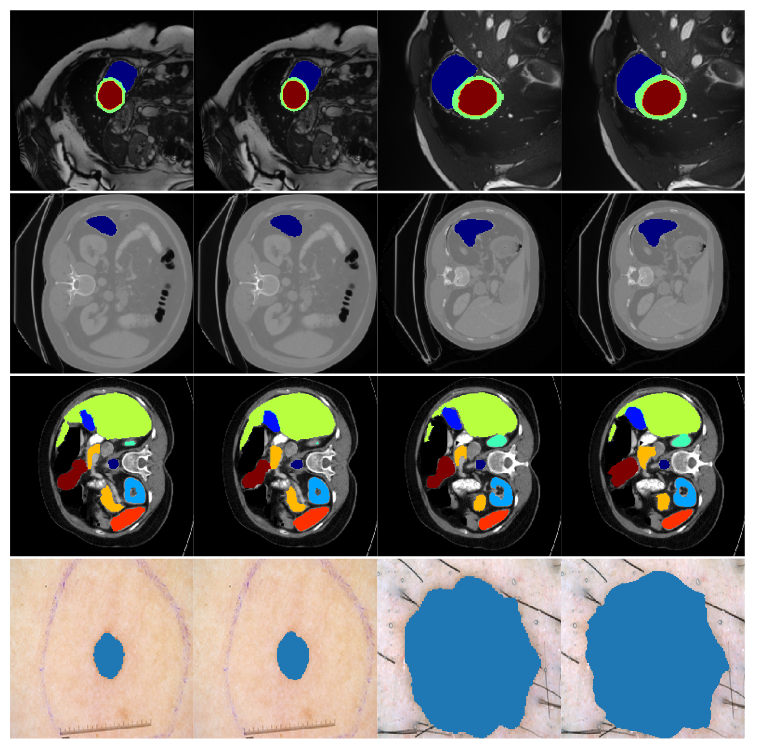

 	

# The Fully Convolutional Transformer for Medical Image Segmentation

## Overview
We propose a novel transformer model, capable of segmenting medical images of varying modalities. Challenges posed by the fine grained nature of medical image analysis mean that the adaptation of the transformer for their analysis is still at nascent stages. The overwhelming success of the UNet lay in its ability to appreciate the fine-grained nature of the segmentation task, an ability which existing transformer based models do not currently posses. To address this shortcoming, we propose The Fully Convolutional Transformer (`FCT`), which builds on the proven ability of Convolutional Neural Networks to learn effective image representations, and combines them with the ability of Transformers to effectively capture long-term dependencies in its inputs. The `FCT` is the first fully convolutional Transformer model in medical imaging literature. It processes its input in two stages, where first, it learns to extract long range semantic dependencies from the input image, and then learns to capture hierarchical global attributes from the features. `FCT` is compact, accurate and robust. Our results show that it outperforms all existing transformer architectures by large margins across multiple medical image segmentation datasets of varying data modalities without the need for any pre-training. `FCT` outperforms its immediate competitor on the ACDC dataset by 1.3%, on the Synapse dataset by 4.4%, on the Spleen dataset by 1.2% and on ISIC 2017 dataset by 1.1% on the dice metric, with up to five times fewer parameters.

[[Paper]](https://openaccess.thecvf.com/content/WACV2023/papers/Tragakis_The_Fully_Convolutional_Transformer_for_Medical_Image_Segmentation_WACV_2023_paper.pdf)

Further information please contact [Chaitanya Kaul](https://chaitanya-kaul.github.io/).

## Author's Implementations

The experiments in our paper are done with the TensorFlow 2 implementation. <ins>The PyTorch implementation is provided here, but is still under development and not fully tested. We will continue to update this repository with more code in both TensorFlow 2 as well as PyTorch to enable maximum reproducibility.</ins>

* [TensorFlow](./TensorFlow)
* [PyTorch](./PyTorch)

## Docker image
chaitanyakaul14/fct-tf:v2

## Results
The performance is evaluated on Dice (higher is better). We release results on the ACDC dataset for now to enable researchers to use our work. The rest of the results will be updated with time.

| Method          		|  Avg. |  RV   |  MYO  |  LV   |
| :---------------------------: | :---: | :---: | :---: | :---: |
| R50 UNet        		| 87.55	| 87.10 | 80.63 | 94.92 |
| R50 Att-UNet    		| 86.75	| 87.58 | 79.20 | 93.47 |
| ViT    			| 81.45	| 81.46 | 70.71 | 92.18 |
| R50 ViT    			| 87.57 | 86.07 | 81.88 | 94.75 |
| TransUNet    			| 89.71 | 88.86 | 84.53 | 95.73 |
| Swin UNet    			| 90.00 | 88.55 | 85.62 | 95.83 |
| LeViT-UNet384	| 90.32 | 89.55 | 87.64 | 93.76 |
| nnUNet    			| 91.61 | 90.24 | 89.24 | 95.36 |
| nnFormer    			| 91.78 | 90.22 | 89.53 | 95.59 |
| FCT224 w/o D.S.    		| 91.49 | 90.32 | 89.00 | 95.17 |
| FCT224 full D.S.    		| 91.49 | 90.49 | 88.76 | 95.23 |
| FCT224    		| 92.84 | 92.02 | 90.61 | 95.89 |
| FCT384     	| 93.02 | 92.64 | 90.51 | 95.90 |

Qualitative results on the different segmentation datasets. From the top - ACDC Segmentation Dataset [Colours - Maroon (LV), Blue (RV), Green (MYO)], Spleen Segmentation Dataset [Colours - Blue (Spleen)], Synapse Segmentation Dataset [Colours - Blue (Aorta), Purple (Gallbladder), Navy (Left Kidney), Aquatic (Right Kidney), Green (Liver), Yellow (Pancreas), Red (Spleen), Maroon (Stomach)] and ISIC 2017 Skin Cancer Segmentation Dataset [Colours - Blue (Skin Cancer)]. The images alternate between the ground truth and the segmentation map predicted by `FCT`. Best viewed in colour.

## Citation
Please cite this paper if you want to use it in your work,

	@article{tragakis2022fully,
	title={The Fully Convolutional Transformer for Medical Image Segmentation},
	author={Tragakis, Athanasios and Kaul, Chaitanya and Murray-Smith, Roderick and Husmeier, Dirk},
	journal={arXiv preprint arXiv:2206.00566},
	year={2022}
	}

## License
MIT License
